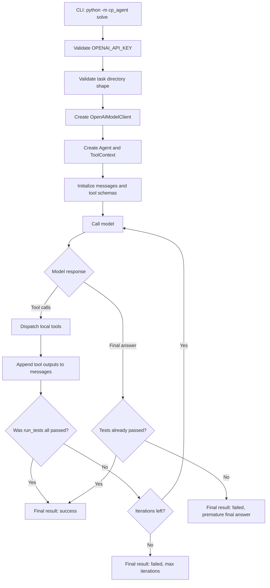
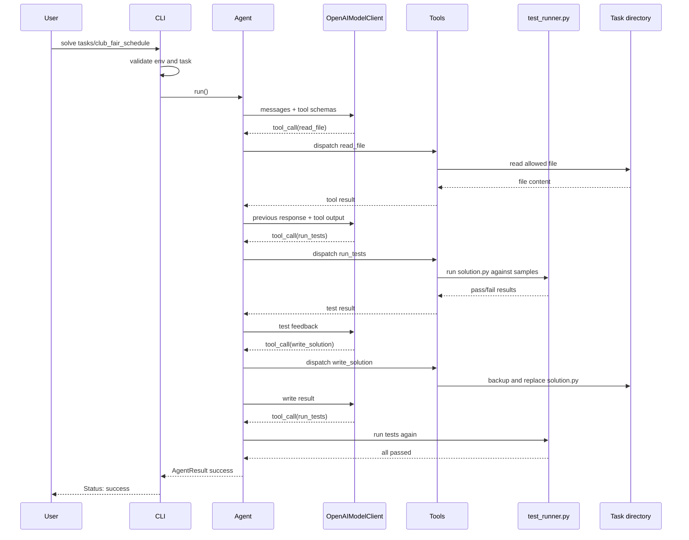

# Agent Workflow

This project is a small educational coding agent for competitive programming tasks. It is intentionally built without LangChain, LangGraph, or another agent framework, so the main idea stays visible:

```text
model + local tools + test feedback + bounded workspace = coding agent
```

The model never reads files or runs commands directly. It asks for one of the allowed tools, Python executes that tool locally, and the tool result is sent back to the model.

## High-Level Loop

The agent loop lives in `src/cp_agent/agent.py`.

At a high level:

1. Build the initial conversation:
   - system prompt from `src/cp_agent/prompts.py`
   - user message pointing at the selected task
2. Send the conversation and tool schemas to the model client.
3. If the model returns tool calls, execute each local tool.
4. Append tool results to the conversation.
5. If `run_tests` reports all tests passed, stop with success.
6. If the model returns a final answer before tests pass, stop with failure.
7. If the iteration limit is reached, stop with failure.

## Workflow Graph



## Sequence Diagram



## Main Modules

| Module | Responsibility |
| --- | --- |
| `cli.py` | Parses `solve`, validates environment and task shape, creates the model client and agent, prints final result. |
| `agent.py` | Owns the explicit model/tool/test loop and stopping rules. |
| `openai_client.py` | Thin wrapper around the official OpenAI SDK and Responses API tool-calling shape. |
| `tools.py` | Defines the exact model-visible tool schemas and dispatches tool calls. |
| `workspace.py` | Enforces safe file reads/writes inside the selected task directory. |
| `test_runner.py` | Runs `solution.py` against `tests/*.in` and compares with `tests/*.out`. |
| `trace.py` | Writes JSONL events for inspecting the run. |
| `fake_model.py` | Provides deterministic fake model responses for tests and debugging without OpenAI calls. |

## Model Boundary

The model receives only four tools:

```text
list_files
read_file
write_solution
run_tests
```

There is intentionally no shell tool and no arbitrary file write.

The model can ask:

```json
{"path": "statement.md", "reason": "I need to understand the task statement"}
```

but it cannot directly open `statement.md` itself. Python checks the request, reads the file if it is allowed, and returns the result.

Every model-facing tool schema requires a short public `reason` string. Verbose mode prints that reason in lines such as:

```text
[1] I am using read_file(statement.md) because I need to understand the task statement.
```

The reason is for observability and teaching the workflow. The dispatcher strips it before running the local tool, and it must not contain hidden chain-of-thought.

## Safe Workspace Boundary

The selected task directory is the workspace. In v0:

- readable files:
  - `statement.md`
  - `solution.py`
  - `tests/*.in`
  - `tests/*.out`
- writable file:
  - `solution.py`

The workspace layer resolves real paths before allowing access. Requests such as these are rejected:

```text
../secret.txt
/etc/passwd
~/.ssh/id_rsa
tests/link_to_outside_file.in
```

`write_solution` also creates:

```text
.solution.py.bak
```

before replacing `solution.py`.

## Test Feedback

`run_tests` executes:

```text
python solution.py < tests/sample.in
```

for each matching `.in` / `.out` pair. It captures:

- stdout
- stderr
- exit code
- runtime
- expected output
- actual output
- pass/fail status

Output comparison normalizes trailing whitespace per line and final trailing newlines.

Timeouts are reported as failed tests with:

```json
{"error": "timeout", "exit_code": null}
```

## Stopping Rules

The agent stops when one of these happens:

- `run_tests` reports `all_passed: true`: success.
- the model returns a final answer before tests pass: failure.
- `max_iterations` is reached: failure.

The CLI prints a compact result:

```text
Status: success
Iterations: 6
Tests: 2/2 passed
Modified: solution.py
```

## Tracing

Use `--trace-file` to inspect what happened:

```bash
uv run python -m cp_agent solve tasks/club_fair_schedule \
  --max-iterations 8 \
  --timeout-seconds 3 \
  --trace-file trace.jsonl \
  --verbose
```

The trace file is JSONL: one JSON object per line.

Typical event types:

```text
model_request
model_response
tool_call
tool_result
test_summary
final
```

Example:

```json
{"iteration": 1, "type": "model_request"}
{"final": false, "iteration": 1, "tool_calls": ["read_file"], "type": "model_response"}
{"args": {"path": "statement.md", "reason": "I need to understand the task statement"}, "iteration": 1, "tool": "read_file", "tool_call_id": "call_abc", "type": "tool_call"}
{"iteration": 1, "result": {"ok": true, "path": "statement.md"}, "tool": "read_file", "tool_call_id": "call_abc", "type": "tool_result"}
```

To print only tool calls:

```bash
uv run python -c 'import json; [print(e["iteration"], e["tool"], e["args"]) for e in map(json.loads, open("trace.jsonl")) if e["type"] == "tool_call"]'
```

Trace files summarize tool results. They should not contain API keys, environment secrets, full file contents, or very large outputs.

## Debugging In PyCharm

Create a Python run/debug configuration:

```text
Module name: cp_agent
Parameters: solve tasks/club_fair_schedule --max-iterations 8 --timeout-seconds 3 --trace-file trace.jsonl --verbose
Working directory: /Users/ernest.molczan/PycharmProjects/CPAgent
Environment: OPENAI_API_KEY=...
```

Good breakpoints:

- `cli.py`: `solve()`
- `agent.py`: `Agent.run()`
- `openai_client.py`: `complete()` and `parse_response()`
- `tools.py`: `dispatch_tool()`
- `workspace.py`: `read_file()` and `write_solution()`
- `test_runner.py`: `run_test_case()`
- `trace.py`: `TraceWriter.write()`

For debugging without OpenAI calls, run:

```text
tests/test_agent_loop_fake_model.py
```

That test uses the full local tool loop with a deterministic fake model.

## How To Explain This To Students

The important lesson is that an agent is not magic. It is a loop:

```text
ask model what to do
run a safe local action
show the result to the model
repeat until done
```

For competitive programming, the key feedback signal is tests. The model proposes a fix, but tests decide whether the fix worked.
